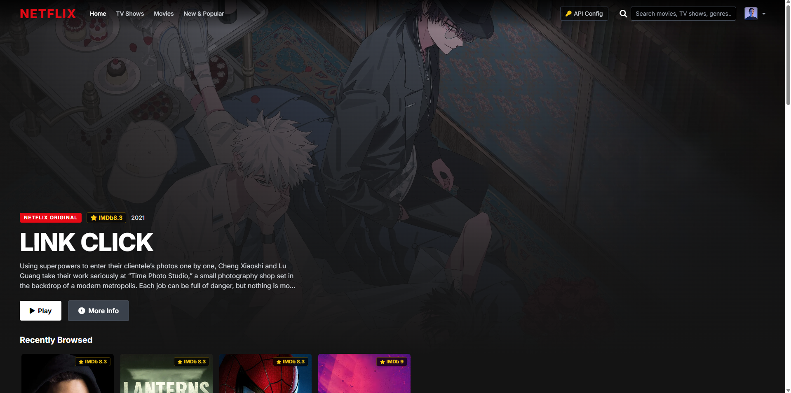
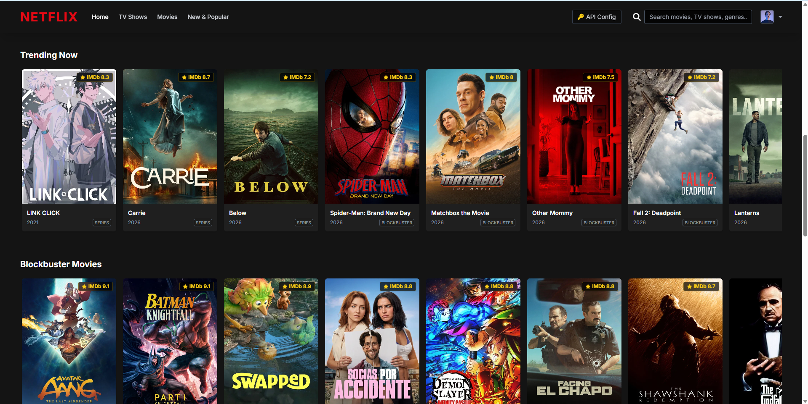
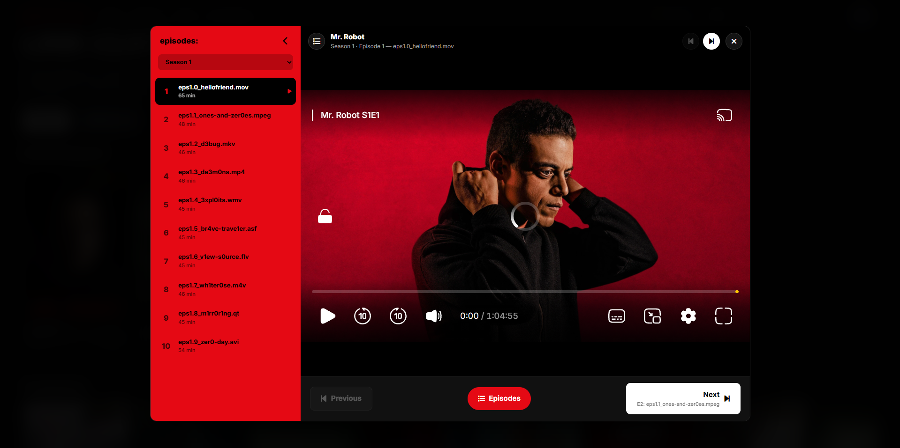
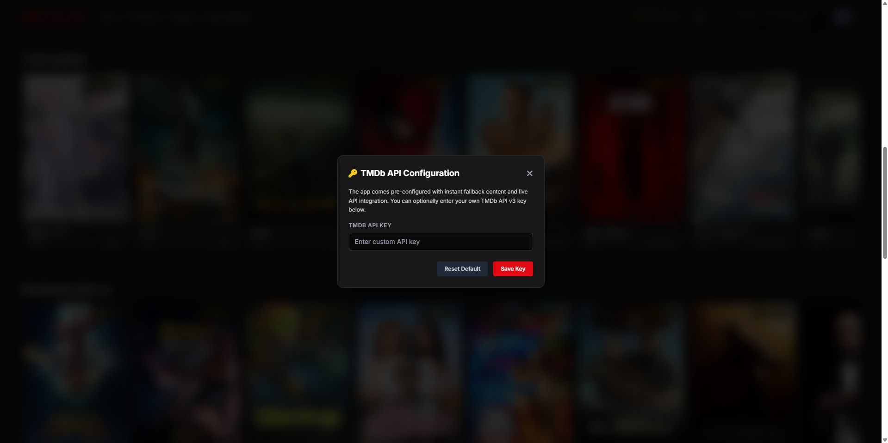

<div align="center">

# 🎬 NetflixxClone

**A Netflix-style streaming browser built with plain HTML, Tailwind and vanilla JavaScript.**

[](https://reebal-0.github.io/netflixxlone/)




</div>

---

## ✨ Features

- 🎞️ **Hero banner** with the featured title, rating and one-click play
- 📚 **Category rows** (Trending, Movies, Series…) with hover-zoom cards
- 🔎 **Live search** across movies and TV shows
- 🕑 **Recently browsed** row that remembers what you looked at
- 📄 **Details modal** with synopsis, cast, genres and a full season/episode list
- 📺 **Episode player**
  - Red **episodes sidebar** with season picker and the current episode highlighted
  - **Previous / Next episode** buttons (top bar and bottom bar), crossing season boundaries
  - Keyboard shortcuts: `N` next · `P` previous · `E` toggle episodes · `Esc` close
  - Mobile-friendly: the sidebar becomes a slide-over drawer
- 🔑 **Bring your own TMDb key** from the in-app settings button

## 📸 Screenshots

### Home


### Browse rows


### Episode player


### Bring your own TMDb key


## 🚀 Run it locally

No build step needed.

```bash
git clone https://github.com/reebal-0/netflixxlone.git
cd netflixxlone
```

Then just open `index.html` in your browser (or use VS Code's *Live Server*).

### Use your own TMDb API key

1. Create a free account at [themoviedb.org](https://www.themoviedb.org/) and request an API key.
2. Click **API Config** in the top-right of the app and paste it in.
   The key is stored in your browser's `localStorage` only.

## 🗂️ Project structure

```
netflixxlone/
├── index.html   # Layout: navbar, hero, rows, modals, player
├── app.js       # Catalog loading, search, modals, episode player logic
└── style.css    # Custom styles (cards, hero gradient, player UI)
```

## 🛣️ Roadmap

- [ ] Autoplay next episode
- [ ] Resume where you left off
- [ ] "My List" saved to localStorage
- [ ] Genre filter pages

## ⚠️ Disclaimer

This is a **learning project** and is **not affiliated with, endorsed by, or connected to Netflix**.
Movie and TV metadata and artwork come from [TMDb](https://www.themoviedb.org/); this product uses the TMDb API but is not endorsed or certified by TMDb.
This repository does not host any video content.

## 📄 License

Released under the [MIT License](LICENSE).

---

<div align="center">
Made by <a href="https://github.com/reebal-0">reebal-0</a> · If you like it, drop a ⭐
</div>
